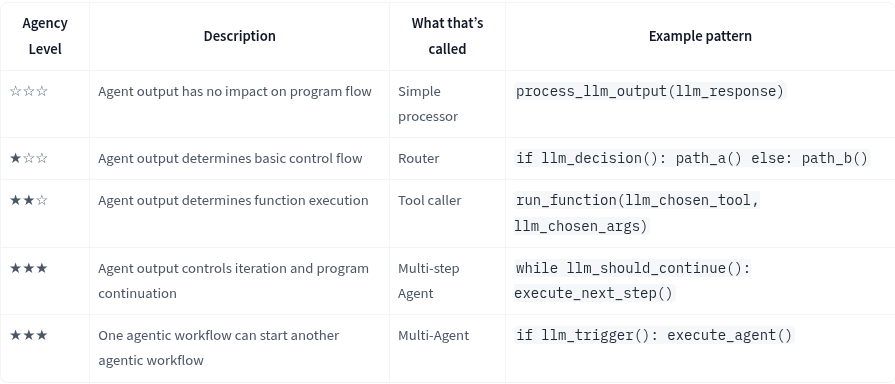

# Notes and Learnings 
1. Think and Plan --> Select the available tools --> Act using those tools
    - The Brain (AI Model) - Reasoning and planning
    - The Body (Capabilities and tools) - Taking actions based on equipped tools
    - We call it Agent because it has agency, aka it has the ability to interact with the environment.
2. ## LLM
    - Usually LLM models are used as AI models in Agents - trained in large amount of texts - takes and generates outputs - Interact with environment using tools
    - Objective isto predict the next token, given a sequence of previous tokens
        - A token is a unit of information for a given word
    ### Transformers
    - LLM built on Transformer architecture
        - ### 3 Types of Transformers
            - Encoders
                - I/P - Word , O/P - Dense Word embeddings of the input word
                - Text Classification, Semantic search, NER
                - BERT from Google
            - Decoders
                - Generate new token from previous one, to complete a sentence <b> ONE TOKEN AT A TIME </b>
                - Text Gen, Chatbots, code Genereation...
                - Llama from Meta
            - Seq2Seq
                - Encoders process input sequence into a context representation, Decoder produces output sequence.
                - Transalation, Summary, Paraphrasing
                - T5, BART 

    - Spectrum of Agency
        - 
### General Commands and errors
1. ollama run <model_name ex.gemma3>